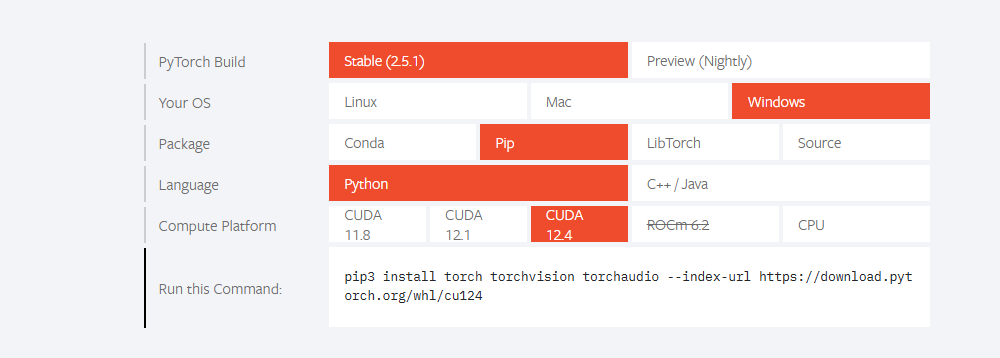
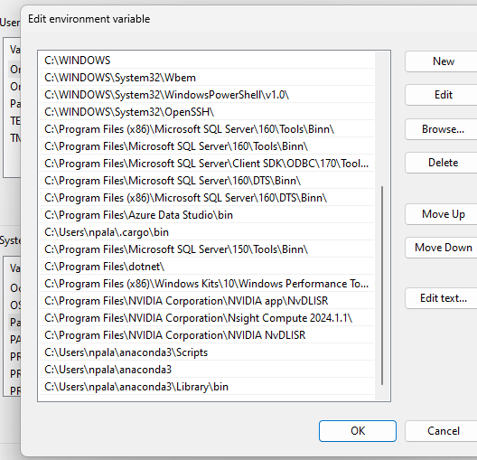

# Prerequisite

## NVIDIA GPU Drivers

- **System Requirements**: Your system must have NVIDIA GPU hardware. For example, I have an NVIDIA GeForce RTX 3060.
- **Check and Install Drivers**:
  - Open the NVIDIA Control Panel to confirm the drivers are installed.
  - If not installed, visit the [NVIDIA Drivers Portal](https://www.nvidia.com/Download/index.aspx) to download the compatible drivers.

## Visual C++ Redistribution

- Install Visual Studio with C++ components.
  Make sure to select all visual c++ components from explicit selection
- Ensure all C++ options are selected during installation.
- [Download Visual Studio Community Edition](https://visualstudio.microsoft.com/vs/community/)

## PyTorch

- Visit the PyTorch portal to check for the compatible CUDA Toolkit version required for your setup.

## CUDA Toolkit
12.1 is the stable version i installed. 
- Download the required CUDA Toolkit version from the [CUDA Toolkit Archive](https://developer.nvidia.com/cuda-toolkit-archive).

## CUDNN
this is the latest version 
get latest zip for CUDNN - https://developer.nvidia.com/rdp/cudnn-archive 
UnZIP and Copy each folder under bin the DLL from this folder to NVIDIA CUDA Dev Tool KIT ->Bin folder 
Goto all folders in directory and copy them inside bin for Cuda

conda install pytorch torchvision torchaudio pytorch-cuda=12.4 -c pytorch -c nvidia

## Credits
Credit to Boktiar Ahmed Bappy - I referred his articles and learned this. 
https://youtu.be/nATRPPZ5dGE 